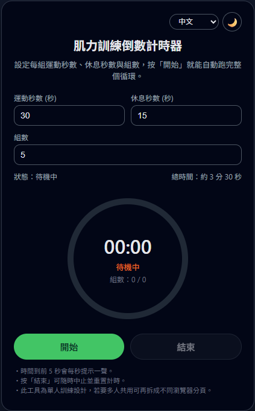
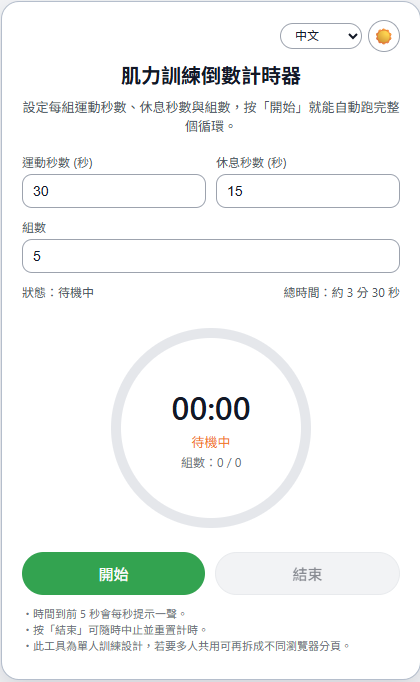
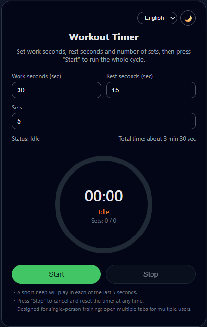
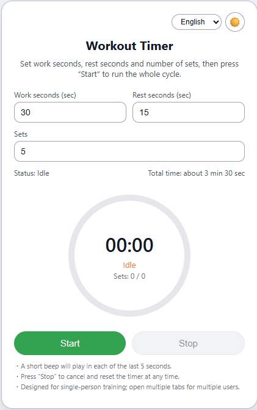

## Workout Timer - 肌力訓練倒數計時器

 
 

# 中文說明 

這是一個用 Flask 開發的簡易肌力／間歇訓練倒數計時器。

### 功能特色

- ✅ 自訂每組 **運動時間（秒）**
- ✅ 自訂每組 **休息時間（秒）**
- ✅ 自訂 **組數**
- ✅ 圓形圖形倒數（SVG 進度圈）
- ✅ 時間到前 **5 秒** 每秒提示音
- ✅ **開始 / 結束** 按鈕
- ✅ 支援桌機與手機瀏覽器（基本 RWD）


---
### 環境需求

* Python 3.9 以上（建議 Python 3.10 或 3.11）
* pip
* Docker 20+ 以上版本
---

### 使用 Docker 部署

1. 建立映像檔
```
docker build -t workout-timer .
```

2. 以 Docker 執行容器, 使用 port 80

```
docker run -d --name workout-timer \
  -p 80:5000 \
  workout-timer

```
瀏覽器開啟：
```
http://<伺服器 IP>
```

# English 
A simple, browser-based interval workout timer built with Flask.

### Features

- ✅ Customize **work time per set (seconds)**
- ✅ Customize **rest time per set (seconds)**
- ✅ Customize **number of sets**
- ✅ Circular visual countdown (SVG progress ring)
- ✅ Beep sound for each of the last **5 seconds**
- ✅ **Start / Stop** buttons
- ✅ Support desktop and mobile browsers (basic RWD)

---
### Requirements

* Python 3.9 or higher (Python 3.10 or 3.11 recommended)
* pip
* Docker 20+ or higher
---

### Deployment

1. Build the image
```
docker build -t workout-timer .
```

2. Run the container with port 80 exposed
```
docker run -d --name workout-timer \
  -p 80:5000 \
  workout-timer

```
Open browser:
```
http://<server-ip>
```